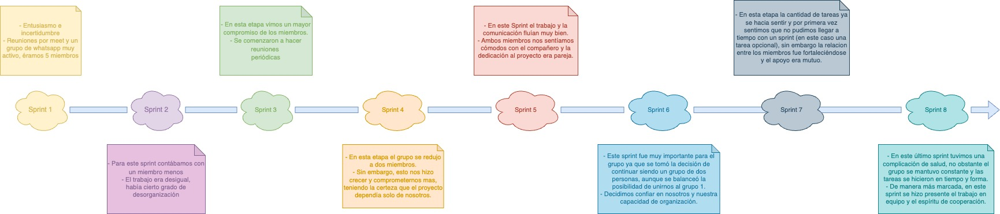

 # Retrospectiva del trabajo grupal:

 
## Análisis General

>En este último sprint (y el último tiempo en general), el cúmulo y la complejidad de las tareas a realizar se hicieron sentir con mayor intensidad. Todo esto, con el agravante de un problema de salud que nos retrasó y entorpeció el trabajo.  Además, como crítica constructiva hacia nosotros mismos, pudimos ver la importancia de cumplir con los pendientes en tiempo y forma, y no dejar para último momento detalles que tal vez pueden ser solucionados en el momento en el que los conocimientos están frescos.

>No obstante, como en los Sprints anteriores, el trabajo en equipo tuvo un mayor protagonismo. Logramos organizarnos bajo presión y poder resolver todos aquellos obstáculos que se nos presentaron, a la vez que ibamos sintiéndonos cada vez más orgullosos del trabajo logrado sin dejar de ser conscientes de las posibles mejoras que podrían implementarse en el sitio.

>Como reflexión final, a la satisfacción personal -y grupal- por lo que logramos en estos meses nos gustaría sumar el agradecimiento a los profesores, al grupo de alumnos y al espacio otorgado por Digital House, ya que gracias a todo ello tuvimos la oportunidad de poner a prueba nestras capacidades, nuestra resiliencia y, como si fuera poco, pudimos hacer amigos y sentirnos cómodos inlcuso en la virtualidad.

 

